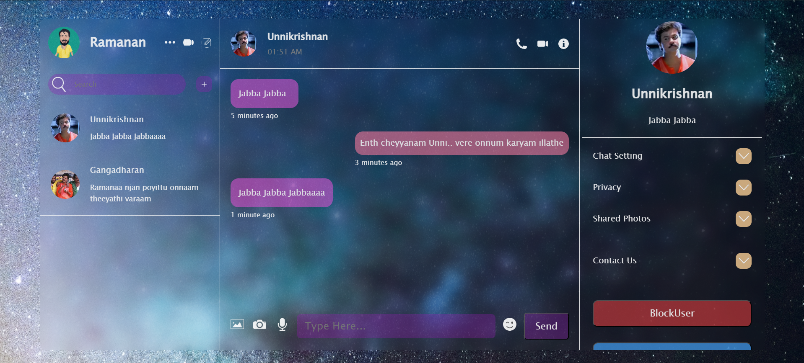

# Chatikoo
"Chatikoo" is a user-friendly chat application designed to connect friends effortlessly. Built using React, Firebase, and Zustand, it offers a seamless experience with no mandatory verification process, ensuring quick access for all users.

## Key Features:
### Simple Interface: 
Chatikoo boasts an intuitive design that allows users to start chatting instantly without any complex setup.

### Messaging Functionality: 
Users can send and receive text messages in real-time, enabling smooth and immediate communication.

### Image Sharing: 
It supports direct image uploads from the user's device, making it easy to share photos and visuals within conversations.
 
### Blocking Option: 
To ensure a safe environment, Chatikoo includes a feature that allows users to block others, giving them control over their interactions.

### Firebase Integration: 
Leveraging Firebase ensures reliable backend services, including real-time database updates and secure user authentication.

### Persistent State Management: 
Zustand is used for state management, ensuring efficient handling of application data and UI updates.

User Experience:
Chatikoo focuses on delivering a smooth and enjoyable chatting experience:

No Verification Required: Users can dive straight into conversations without the hassle of email or phone verification.
Instant Messaging: Messages appear instantly, creating a real-time chat environment.
Intuitive Controls: Clear and straightforward buttons for sending messages and images ensure ease of use.
Personalization: Users can customize their profiles and manage their interactions, including blocking unwanted contacts.
Security and Privacy:
Secure Authentication: Firebase authentication ensures that user credentials are protected.
Data Encryption: All data transmissions are encrypted, maintaining user privacy and security.
Future Enhancements:
Potential future updates could include:

Additional Media Support: Expanded support for video sharing and other media types.
Enhanced Notifications: Alerts for new messages and updates.
Customizable Themes: Personalized themes and UI customization options.
Chatikoo aims to provide a reliable and enjoyable chatting experience for all users, focusing on simplicity, security, and effective communication.
